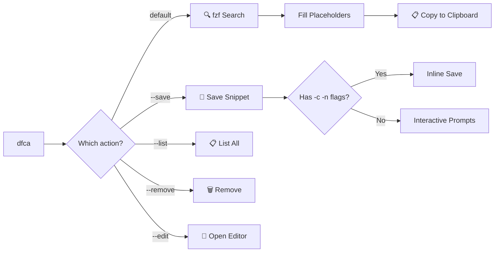

<div align="center">

```
  ██████╗ ███████╗ ██████╗ █████╗
  ██╔══██╗██╔════╝██╔════╝██╔══██╗
  ██║  ██║█████╗  ██║     ███████║
  ██║  ██║██╔══╝  ██║     ██╔══██║
  ██████╔╝██║     ╚██████╗██║  ██║
  ╚═════╝ ╚═╝      ╚═════╝╚═╝  ╚═╝
```

# Don't Forget Commands Again

**A local-first CLI tool to search, save, and inject complex commands instantly.**

> [!WARNING]
> **Windows Only** (for now). Linux/macOS support is planned for v2.


*Created by [Amine Jameli](https://github.com/aminejameli)*

[](https://github.com/PowerShell/PowerShell)
[](https://github.com/junegunn/fzf)
[](LICENSE)

[Installation](#-installation) •
[Usage](#-usage) •
[Commands](#-commands) •
[Snippets](#-snippet-format) •
[Project Structure](#-project-structure)

</div>

---

## 🎯 The Problem

You use dozens of complex commands daily — Docker, Kubernetes, Git, SSH, DevOps pipelines — but you can never remember the exact syntax when you need it.

**DFCA solves this.** Save once, search instantly, inject anywhere.

---

## ✨ Features

| Feature | Description |
|---------|-------------|
| 🔍 **Fuzzy Search** | Find any command instantly with [fzf](https://github.com/junegunn/fzf) |
| 💾 **Save from CLI** | Add commands without editing files — inline or interactive |
| 📋 **Clipboard Injection** | Selected commands are copied to clipboard, ready to paste |
| 🏷️ **Categories & Tags** | Organize commands by category and searchable tags |
| 🔧 **Placeholders** | Use `{{variable}}` tokens — DFCA prompts you to fill them |
| 👁️ **Live Preview** | See full command details in a split-pane preview window |
| 🌐 **Works Everywhere** | PowerShell, CMD — type `dfca` from any terminal |
| 📦 **100% Local** | No cloud, no accounts. Your data stays on your machine |

---

## 📦 Installation

### Prerequisites

| Tool | Install |
|------|---------|
| **PowerShell 7+** | `winget install Microsoft.PowerShell` |
| **fzf** | `winget install junegunn.fzf` |

### Install DFCA

```powershell
git clone https://github.com/aminejameli/never-forget-cmd-again.git
cd never-forget-cmd-again
pwsh -File install.ps1
```

That's it. Open a **new terminal** and type `dfca`.

> [!NOTE]
> The installer copies DFCA to `~/.config/dfca/` and adds it to your PATH permanently.
> Works in both **PowerShell** and **CMD** out of the box.

---

## 🚀 Usage

### Search & Select (Default)

Just type `dfca` — the fuzzy finder launches with all your saved commands:

```
dfca
```

- **↑↓** Navigate through commands
- **Type** to fuzzy-search by name, category, or tags
- **Enter** to select → fills placeholders → copies to clipboard
- **Esc** to cancel

### Save a Command

#### Inline (one-liner)

```powershell
dfca --save -c "docker exec -it {{container}} /bin/bash" -n "Shell into container" -cat "docker" -t "docker,exec,bash" -d "Open an interactive bash shell inside a running container"
```

#### Interactive (guided prompts)

```powershell
dfca --save
```

DFCA will walk you through each field:

```
  ▸ Command (required): docker logs -f --tail 100 {{container}}
  ▸ Name (required): Follow container logs
  ▸ Category (default: general): docker
  ▸ Tags (comma-separated): docker, logs, debug
  ▸ Description (optional): Stream the last 100 lines of container logs
```

### List All Snippets

```powershell
dfca --list
```

Prints a formatted, color-coded table of all saved commands.

### Remove a Snippet

```powershell
dfca --remove
```

Opens the fzf selector — pick a snippet, confirm with `yes`, and it's gone.

### Edit Snippets File

```powershell
dfca --edit
```

Opens `snippets.yaml` in VS Code, `$EDITOR`, or Notepad.

---

## 📋 Commands

| Command | Description |
|---------|-------------|
| `dfca` | Launch fuzzy search and select a command |
| `dfca --save` | Interactive save mode |
| `dfca --save -c "cmd" -n "name"` | Inline save (minimal) |
| `dfca --save -c "cmd" -n "name" -cat "cat" -t "tags" -d "desc"` | Inline save (full) |
| `dfca --list` | Show all saved snippets |
| `dfca --remove` | Select and delete a snippet |
| `dfca --edit` | Open snippets YAML in your editor |

### Save Flags

| Flag | Alias | Required | Description |
|------|-------|----------|-------------|
| `-Command` | `-c` | ✅ | The command string |
| `-Name` | `-n` | ✅ | Human-readable name |
| `-Category` | `-cat` | ❌ | Category (default: `general`) |
| `-Tags` | `-t` | ❌ | Comma-separated tags |
| `-Description` | `-d` | ❌ | What the command does |

---

## 📄 Snippet Format

Snippets are stored in `~/.config/dfca/data/snippets.yaml`:

```yaml
- category: docker
  name: Shell into container
  command: "docker exec -it {{container}} /bin/bash"
  description: "Open interactive bash shell in a running container"
  tags: [docker, exec, bash]

- category: git
  name: Interactive rebase
  command: "git rebase -i HEAD~{{commits}}"
  description: "Squash or reorder the last N commits"
  tags: [git, rebase, history]

- category: ssh
  name: Connect to production
  command: "ssh {{user}}@{{host}} -p {{port}}"
  description: "SSH into a remote server"
  tags: [ssh, remote, server]
```

### Placeholders

Use `{{variable_name}}` anywhere in a command. When you select it, DFCA prompts you for each value:

```
  ▸ {{container}}: my-api-container
  ▸ {{port}}: 3000
```

---

## 📁 Project Structure

```
~/.config/dfca/
├── bin/
│   ├── dfca.ps1          # Launcher (PS5/PS7 compatible)
│   ├── dfca-main.ps1     # Main entry point with CLI routing
│   └── dfca.cmd           # CMD shim for Windows
├── modules/
│   ├── DFCA.Utils.psm1    # Dependency checks & YAML loading
│   ├── DFCA.UI.psm1       # fzf integration & clipboard
│   └── DFCA.Snippets.psm1 # Save, list, remove operations
└── data/
    └── snippets.yaml      # Your command library
```

---

## 🔧 How It Works



---

## 🤝 Contributing

1. Fork it
2. Add your snippets or features
3. Submit a PR

---

## 📜 License

MIT © 2026 [Amine Jameli](https://github.com/aminejameli)

---

<div align="center">
<sub>Built with ❤️ for developers who forget commands</sub>
</div>
